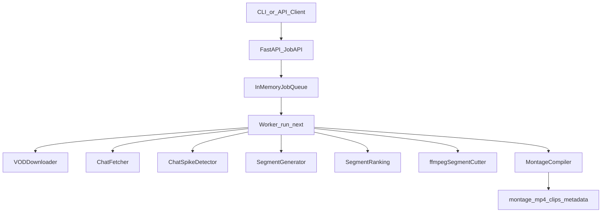
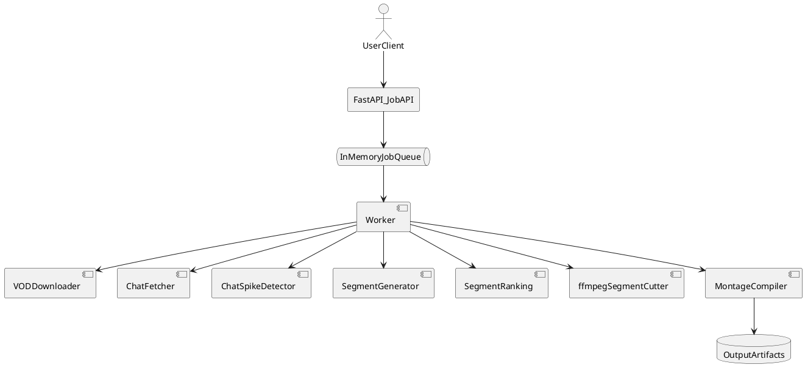

# TwitchClipper

TwitchClipper generates highlight montages from long Twitch VODs by using chat activity as an engagement signal.

## Problem

Twitch streams are often several hours long, and manually finding highlight moments is slow and inconsistent.

## Solution

TwitchClipper automates VOD highlight generation by fetching replay chat, detecting chat spikes, ranking candidate segments, cutting clips, and compiling a final montage.

## Key Features

- Automated clip discovery from VOD + chat replay
- Chat spike detection (messages-per-window signal)
- VOD segmentation around high-engagement moments
- Segment ranking with optional keyword bonuses
- ffmpeg-based segment cutting and montage compilation
- In-memory job queue + worker processing via REST API
- Optional SQLite persistence for jobs and output artifact paths

## Tech Stack

- Python
- FastAPI
- ffmpeg
- Selenium
- MoviePy
- pytest

## Example Workflow

1. User submits a VOD URL
2. System downloads the VOD
3. Chat replay is fetched
4. Chat spikes are detected
5. Segments are generated around spikes
6. Segments are ranked
7. Clips are cut with ffmpeg
8. Final montage is compiled

## Architecture At A Glance



PlantUML alternative:



For a deeper architecture write-up, see `docs/architecture.md`.

## Ranking Algorithm

Segment ranking is currently implemented in `backend/segment_scoring.py` and driven by `backend/vod_chat_pipeline.py`.

Current scoring formula:

```text
total_score = spike_score + keyword_bonus
```

Where:
- `spike_score` comes from chat spike strength on the segment window
- `keyword_bonus` adds a fixed amount per matched keyword in nearby chat context
- keyword bonus is capped (`keyword_cap`) to avoid over-weighting repeated keyword matches

Tie-break order for sorting segments:
1. Higher `total_score`
2. Higher raw `spike_score`
3. Earlier `start_s`
4. Earlier `end_s`
5. Stable input index

## Example Output

Typical output directory after a VOD highlight job:

```text
vod_output/
  montage.mp4
  vod.mp4
  vod.json
  chat.jsonl
  clips/
    segment_000_1223_1241.mp4
    segment_001_2490_2510.mp4
```

Example VOD metadata (`vod.json`):

```json
{
  "vod_url": "https://www.twitch.tv/videos/2699448530",
  "vod_path": "vod_output/vod.mp4",
  "is_twitch": true,
  "title": "Ranked climb stream",
  "uploader": "example_streamer",
  "duration_s": 21600
}
```

Example segment rationale entry (derived from ranked segment data for inspection):

```json
{
  "segment": 1,
  "start_s": 1223,
  "end_s": 1241,
  "spike_score": 43.0,
  "keyword_bonus": 5.0,
  "total_score": 48.0,
  "reason": "chat spike with keyword match near segment window"
}
```

## System Limitations

- Chat spikes are a useful proxy for engagement but do not always map to gameplay highlights.
- Twitch chat replay availability/completeness can vary by VOD and region.
- Selenium + web scraping selectors and non-official Twitch web endpoints are best-effort and may break when Twitch changes frontend behavior.
- ffmpeg, browser driver setup, and local environment differences can impact portability and reliability.

## Development

### Prerequisites

- `Python 3.10+`
- `Selenium`, `MoviePy`, `natsort`, `Pillow`, `pywin32`
- `Firefox + geckodriver`
- `ffmpeg` on PATH

`geckodriver.exe` should be on PATH or placed in `backend/` (scripts check this location). You can optionally set `GECKODRIVER_PATH`.

### Local Setup

```bash
python -m pip install -r requirements.txt
```

### Selenium Setup (first-time)

```bash
python scripts/setup_selenium.py
```

### Run Locally

```bash
uvicorn api.app:app --reload
# or: uvicorn api.main:app --reload
python cli/main.py vod-highlights --vod-url "https://www.twitch.tv/videos/2699448530" --output-dir "./vod_output"
```

The CLI VOD montage flow (`cli -> api -> backend`) uses `POST /jobs/vod-highlights` and can drive execution with `/jobs/run-next` until `done` or `failed`.

Optional DB persistence flags (disabled by default):

```bash
# PowerShell
$env:TWITCHCLIPPER_DB_ENABLED=1
$env:TWITCHCLIPPER_DB_PATH="./data/twitchclipper.sqlite3"
```

## Testing

```bash
pytest tests/ --cov=backend --cov-report=term-missing
```

Desktop/API unattended bug sweep preflight:

```bash
python scripts/frontend_bug_sweep.py
```

Integration tests that hit twitch.tv are skipped by default. To enable (PowerShell):

```bash
$env:RUN_TWITCH_INTEGRATION=1
$env:TWITCH_STREAMER="zubatlel"
```

Live VOD smoke test:

```bash
$env:RUN_TWITCH_INTEGRATION=1
pytest tests/api/test_vod_highlights_smoke_integration.py -v -s -m integration
```

Optional smoke overrides:
- `TWITCH_VOD_URL` (default `https://www.twitch.tv/videos/2699448530`)
- `TWITCH_SMOKE_MIN_COUNT` (default `1`)
- `TWITCH_SMOKE_MAX_SEGMENT_SECONDS` (default `120`)
- `TWITCH_SMOKE_DIVERSITY_WINDOWS` (default `8`)

## Docs

Primary hub: `docs/repo_overview.md`

- `docs/architecture.md` - architecture and flow
- `docs/backend_report.md` - backend behavior and known risks
- `docs/glossary.md` - domain terminology quick reference
- `docs/roadmap.md` - product direction and phases
- `docs/TODO.md` - prioritized tasks
- `docs/DEPLOYMENT.md` - deployment notes
- `docs/DEPLOYMENT_QUICKSTART.md` - deployment quickstart
- `docs/frontend_bug_sweep.md` - unattended desktop bug sweep runbook

## Project Guidance

- `AGENTS.md` - repository-wide coding and workflow rules
- `agents/backend-solver-agent.md` - backend/domain guidance
