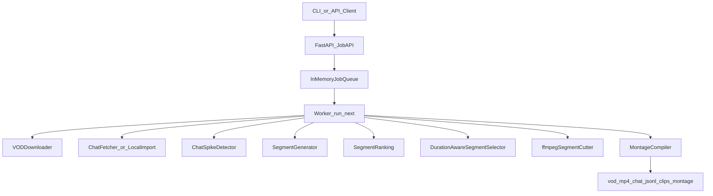
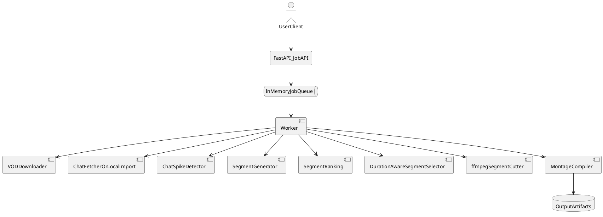

# Architecture Overview

This document describes the current VOD highlight pipeline used by TwitchClipper.

## System Flow



PlantUML version:



## Pipeline Steps

1. Submit `vod_highlights` job through API or CLI.
2. Queue stores the job in memory.
3. Worker pulls one queued job and executes the pipeline.
4. Download VOD to local `vod.mp4`.
5. Fetch replay chat to `chat.jsonl` (or use provided local chat file).
6. Convert chat into spike buckets and candidate segments.
7. Rank segments by spike score plus optional keyword bonus.
8. Select non-overlapping segments under montage constraints.
9. Cut segment clips with ffmpeg into `clips/`.
10. Compile selected clips into `montage.mp4`.

## Ranking Details

Segment and clip scoring wrappers now share small common primitives in
`backend/scoring_common.py` (keyword bonus/cap and deterministic key-based ranking),
while wrapper-specific tie-break and validation rules stay in their own modules.

Current segment scoring (see `backend/segment_scoring.py`):

```text
total_score = spike_score + keyword_bonus
```

- `spike_score`: strength of chat activity for the segment window
- `keyword_bonus`: fixed additive bonus for keyword matches in segment context
- `keyword_cap`: maximum bonus cap to prevent runaway keyword weighting

Sort order is deterministic:
1. higher `total_score`
2. higher `spike_score`
3. earlier `start_s`
4. earlier `end_s`
5. original index as stable final tie-break

## Module Boundaries

- `api/` handles request validation and job endpoints.
- `backend/models/` is the stable shared model import surface for Clip/Segment/Job types.
- Note: `backend/models/*` is a stable import surface only; canonical model definitions still live in `backend/clip_models.py`, `backend/vod_models.py`, and `backend/jobs.py`.
- `backend/job_queue.py` owns in-memory queue behavior.
- `backend/worker.py` orchestrates job handlers and status updates.
- `backend/db/` optionally persists jobs and outputs to SQLite when DB is enabled.
- `backend/vod_download.py`, `backend/vod_chat_fetch.py`, `backend/vod_chat_pipeline.py`,
  `backend/selection.py`, `backend/vod_cut.py`, and `backend/vod_montage.py` own the VOD pipeline stages.
- `cli/` provides script entry points.

## Invariants

- Identical inputs and parameters should produce deterministic ordering and outputs.
- Source VOD is never modified in place; outputs are written as new artifacts.
- Missing dependencies (for example ffmpeg) should fail fast with clear errors.
