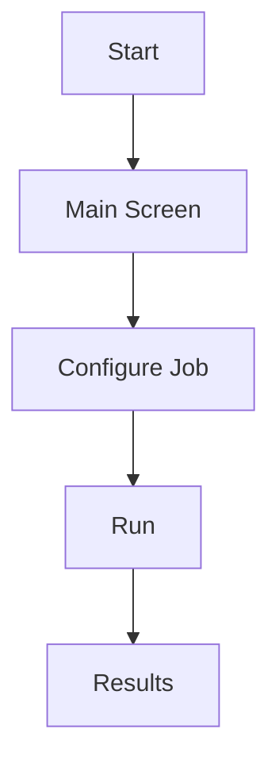
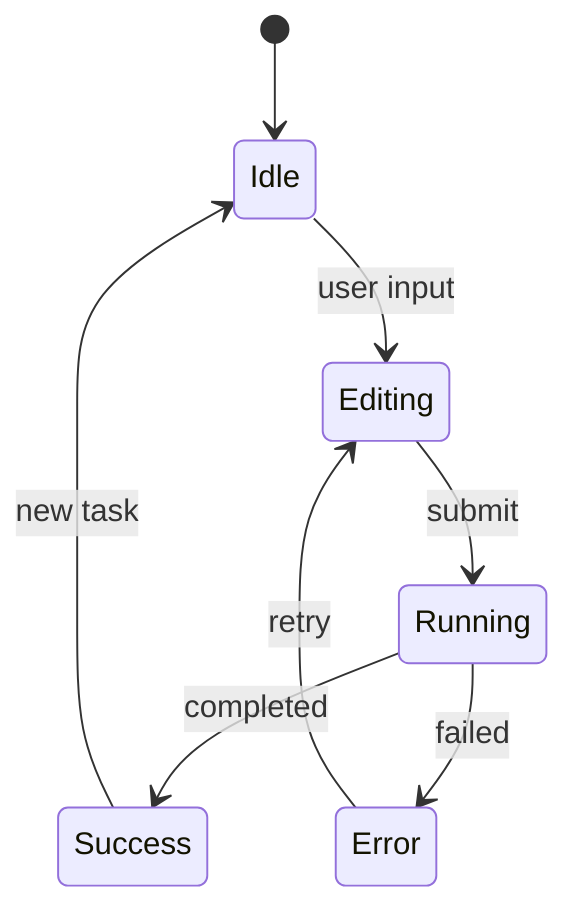
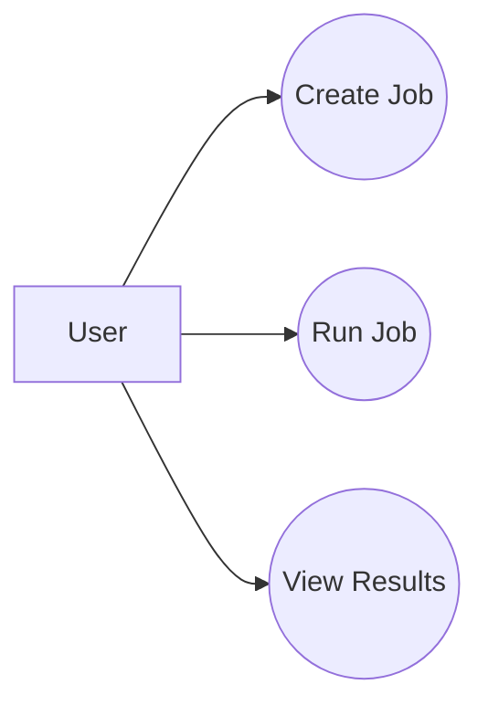
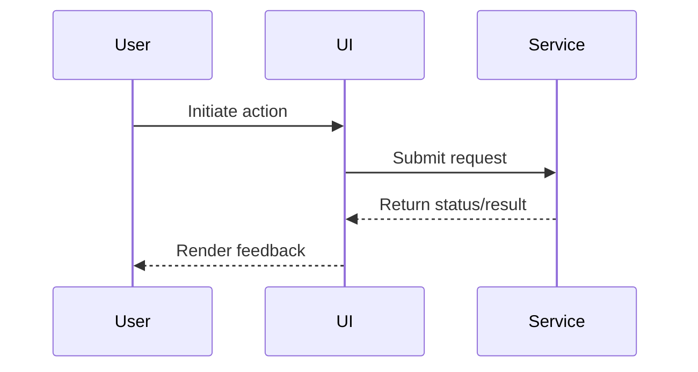
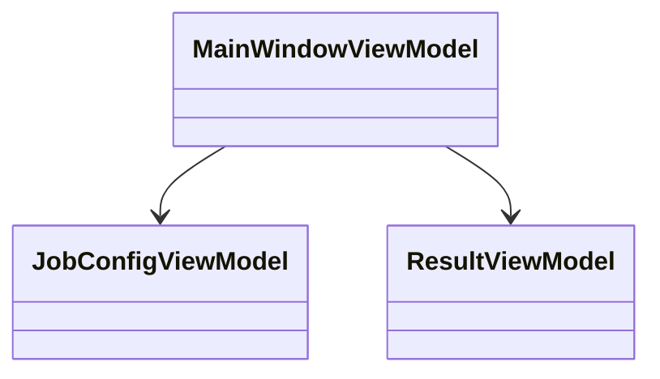

# UI Specification Template

## Document Metadata
- Project:
- Feature/Scope:
- Author:
- Reviewers:
- Last Updated:
- Status: Draft | In Review | Approved
- Related Ticket(s):
- Related Docs:

## 1) Goals and Non-Goals
### Goals
- [ ] Define what this UI must enable users to do.
- [ ] Identify measurable success criteria.
- [ ] Align on desktop app constraints (Windows executable target).

### Non-Goals
- [ ] List explicitly out-of-scope items.
- [ ] Note backend/platform work that is intentionally excluded.

## 2) Target Users and Use Cases
### Primary Users
- User type:
- Skill level:
- Frequency of use:

### Top Use Cases
1.
2.
3.

### User Stories
- As a ___, I want ___, so that ___.
- As a ___, I want ___, so that ___.

## 3) Information Architecture
### Screen Inventory
| Screen ID | Screen Name | Purpose | Entry Point | Exit/Next Screens |
|---|---|---|---|---|
| SCR-001 | | | | |
| SCR-002 | | | | |

### Navigation Model
- [ ] Define top-level navigation pattern.
- [ ] Define deep-link behavior (if any).
- [ ] Define back/cancel behavior.

## 4) User Flow Diagrams
Replace placeholders with your app flow.

### Alternate/Error Flows
- [ ] Invalid input flow:
- [ ] Processing failure flow:
- [ ] Retry/cancel flow:

## 5) Screen Specifications
Repeat this section for each screen.

### Screen: SCR-001 (Name)
#### Purpose
- 

#### Layout Notes
- [ ] Main regions (header/sidebar/content/footer).
- [ ] Relative priority of content blocks.
- [ ] Responsive behavior for window resizing.

#### Components
| Component ID | Type | Label/Text | Behavior | Validation | Notes |
|---|---|---|---|---|---|
| CMP-001 | Button | | | | |
| CMP-002 | Text Input | | | | |

#### Actions and Outcomes
| Action | Trigger | Success Result | Failure Result |
|---|---|---|---|
| | | | |

#### Empty/Loading/Error States
- Empty state:
- Loading state:
- Error state:

## 6) Interaction Rules and UX Decisions
### Input and Validation
- [ ] Required fields:
- [ ] Allowed formats/ranges:
- [ ] Inline vs submit-time validation:

### Feedback and Notifications
- [ ] Success feedback style:
- [ ] Error feedback style:
- [ ] Progress reporting style:

### Keyboard and Accessibility
- [ ] Tab order defined.
- [ ] Keyboard shortcuts defined.
- [ ] Focus states visible.
- [ ] Color contrast checked.
- [ ] Screen reader labels identified.

## 7) State and Data Binding (for C# UI implementation)
### View Models
| View Model | Owned by Screen | Core Properties | Commands |
|---|---|---|---|
| | | | |

### State Transitions

### Data Contracts (UI side)
| DTO/Model | Source | Fields Used in UI | Notes |
|---|---|---|---|
| | | | |

## 8) Backend Integration Points
| UI Action | API/Service Call | Request Shape | Response Shape | Error Handling |
|---|---|---|---|---|
| | | | | |

### Offline/No-Network Behavior
- [ ] Define what works without network.
- [ ] Define user messaging when unavailable.

## 9) Visual Design Tokens (initial)
### Typography
- Font family:
- Base sizes:

### Colors
- Primary:
- Secondary:
- Success/Warning/Error:
- Background/Surface:

### Spacing and Sizing
- Base spacing unit:
- Corner radius:
- Minimum touch/click targets:

## 10) UML Sections
Add and maintain diagrams as scope becomes clear.

### Use Case Diagram

### Sequence Diagram (Key Action)

### Class Diagram (UI Layer Draft)

## 11) Acceptance Criteria
- [ ] Each screen has purpose, components, and states defined.
- [ ] Primary and failure flows are diagrammed.
- [ ] Validation and error messaging are fully specified.
- [ ] Integration points include request/response and failure behavior.
- [ ] Accessibility checklist is completed.

## 12) Open Questions and Risks
### Open Questions
1.
2.
3.

### Risks
- Risk:
  - Impact:
  - Mitigation:

## 13) Change Log
| Date | Author | Change |
|---|---|---|
| | | |
