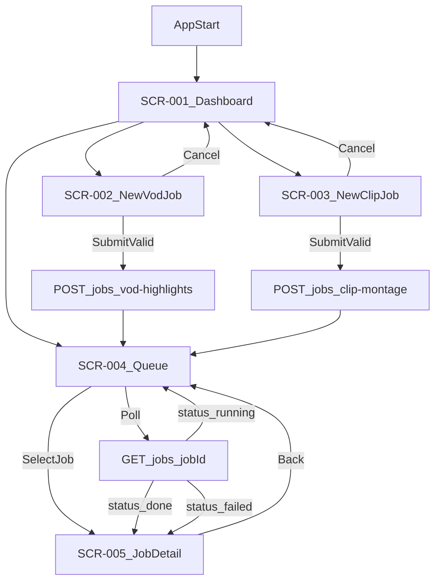
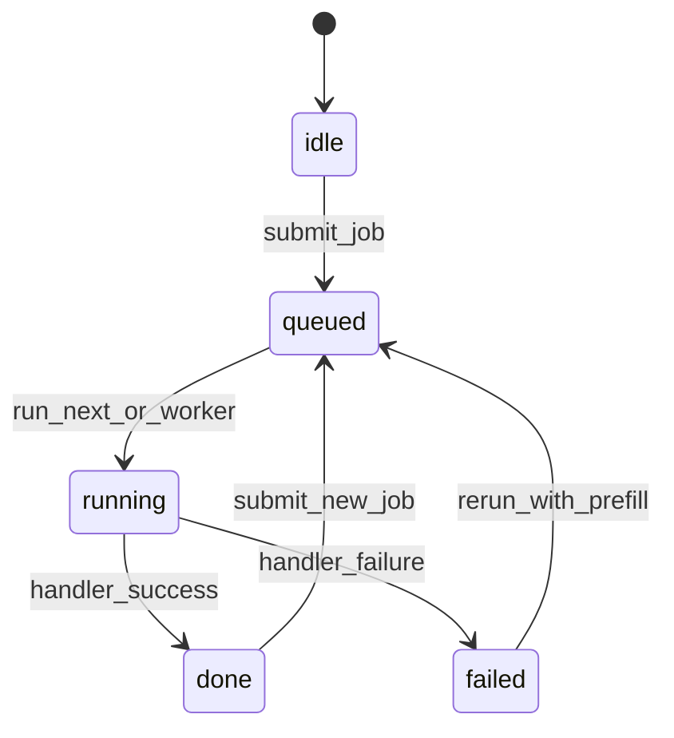
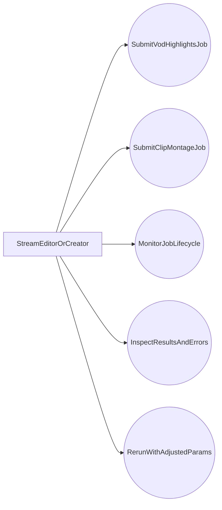
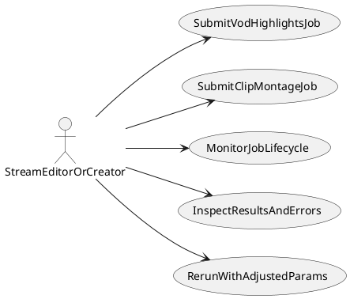
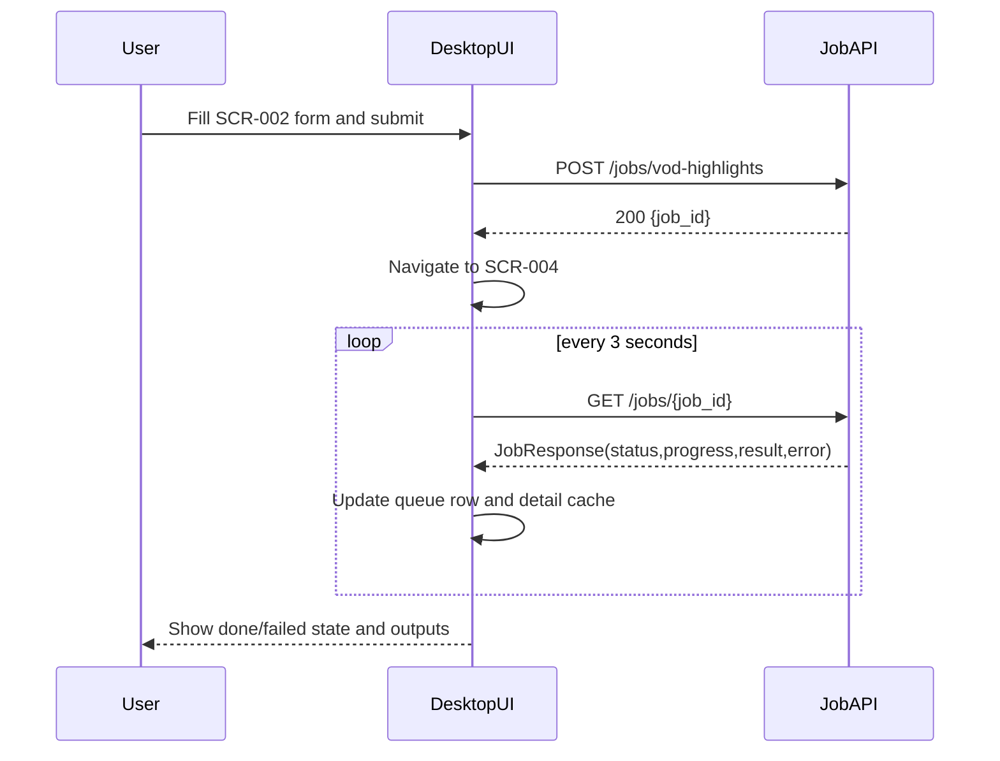
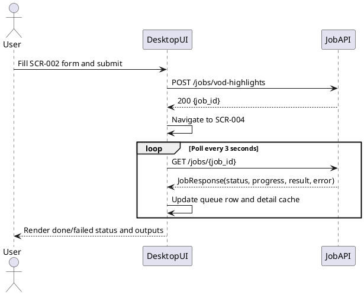
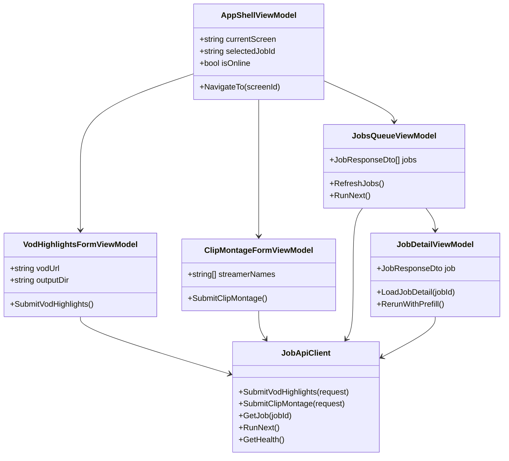
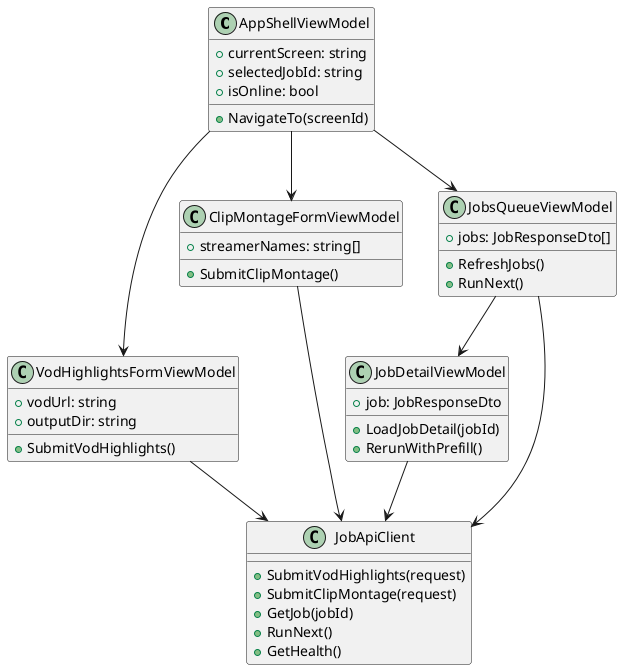
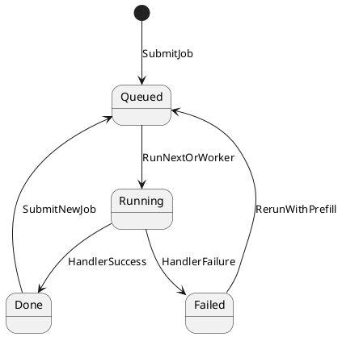

# UI Specification Template

## Document Metadata
- Project: TwitchClipper
- Feature/Scope: Phase 5 Windows desktop UI specification for job submission and monitoring
- Author: MOBS_ (product owner), AI-assisted drafting
- Reviewers: Backend maintainer, QA reviewer
- Last Updated: 2026-03-04
- Status: Implementation Locked
- Related Ticket(s): UI-SPEC-001, UI-SPEC-002, UI-SPEC-003, UI-SPEC-004, UI-SPEC-005, UI-SPEC-006, UI-SPEC-007, UI-SPEC-008, UI-SPEC-009, UI-SPEC-010, UI-SPEC-011, UI-SPEC-012, UI-SPEC-013, UI-SPEC-014, UI-SPEC-015, UI-SPEC-016, UI-SPEC-017, UI-SPEC-018, UI-SPEC-019, UI-SPEC-020, UI-SPEC-021, UI-SPEC-022, UI-SPEC-023, UI-SPEC-024, UI-SPEC-025, UI-SPEC-026, UI-SPEC-027, UI-SPEC-028, UI-SPEC-029, UI-SPEC-030, UI-SPEC-031, UI-SPEC-032, UI-SPEC-033
- Related Docs: `docs/front-end-todo.md`, `docs/roadmap.md`, `docs/repo_overview.md`, `README.md`, `api/app.py`

## 1) Goals and Non-Goals
### Goals
- [x] Enable users to create and submit `vod_highlights` and `clip_montage` jobs without CLI/API calls.
- [x] Provide job lifecycle visibility (`queued`, `running`, `done`, `failed`) with a default polling cadence of 3 seconds and a manual refresh action.
- [x] Ensure required input validation blocks invalid submissions before requests are sent (required fields, numeric range checks, and URL/path checks).
- [x] Support keyboard-first operation for core flows (navigation, form submit, job list selection, and retry/run-next actions).
- [x] Align with Windows desktop constraints: single executable target, minimum supported window size 1280x800, and readable controls at 100-150 percent DPI scaling.

### Non-Goals
- [x] No changes to scoring, VOD/chat processing, ffmpeg behavior, or any backend ranking logic.
- [x] No redesign of the queue worker model or job lifecycle semantics beyond existing API behavior.
- [x] No new backend endpoints in this scope (for example, job cancellation remains unsupported until backend adds a cancel API).
- [x] No Linux/macOS desktop packaging requirements in this phase.
- [x] No full visual design token system definition in this ticket range (covered by later UI-SPEC items).

## 2) Target Users and Use Cases
### Primary Users
- User type: Stream editors and creators generating highlight videos from Twitch VODs.
- Skill level: Intermediate (comfortable with file paths, URLs, and basic troubleshooting).
- Frequency of use: Batch usage several times per week, often multiple jobs per session.

### Top Use Cases
1. Submit a `vod_highlights` job from a Twitch VOD URL (or local file), then monitor progress until output artifacts are ready.
2. Submit a `clip_montage` job for one or more streamers and review job outcome/errors.
3. Inspect completed job details (outputs, metadata, and failures) to decide whether to rerun with adjusted parameters.

### User Stories
- As a stream editor, I want to submit a VOD highlights job with validated inputs, so that I can generate highlight montages without using CLI commands.
- As a creator running multiple jobs, I want a clear status list and detailed result view, so that I can quickly find failures and verify generated outputs.

## 3) Information Architecture
### Implementation Platform Decision (Locked)
- [x] UI framework: **WPF on .NET 8** using MVVM for state/command binding.
- [x] Navigation approach: shell-level content region with ViewModel-driven screen swapping (`SCR-001` to `SCR-005`), not URL routing.
- [x] Dialog approach: native WPF modal dialogs (`Window`/`ContentDialog` equivalent pattern) for destructive/confirm actions.
- [x] Command binding approach: `ICommand`-based actions from screen ViewModels; keyboard shortcuts bound at shell level and delegated to active screen commands.
- [x] Rationale: WPF is Windows-native, stable for desktop data-entry workflows, and aligns with existing C# desktop target without introducing cross-platform complexity in v1.

### Screen Inventory
| Screen ID | Screen Name | Purpose | Entry Point | Exit/Next Screens |
|---|---|---|---|---|
| SCR-001 | App Shell Dashboard | Landing surface with quick actions, recent jobs, and system health snapshot. | App launch | SCR-002, SCR-003, SCR-004 |
| SCR-002 | New VOD Highlights Job | Form to configure and submit `vod_highlights` jobs. | From SCR-001 or primary Navigation | SCR-004 (after submit), SCR-001 (cancel/back) |
| SCR-003 | New Clip Montage Job | Form to configure and submit `clip_montage` jobs. | From SCR-001 or primary Navigation | SCR-004 (after submit), SCR-001 (cancel/back) |
| SCR-004 | Jobs Queue and Status | Table/list view of jobs with status, progress, and filters. | From SCR-001, SCR-002 submit, SCR-003 submit, primary Navigation | SCR-005 (select job), SCR-002, SCR-003 |
| SCR-005 | Job Detail and Results | Detailed job view with parameters, timeline, outputs, and error context. | From SCR-004 (job selection) | SCR-004 (back), SCR-002/SCR-003 (rerun flow) |

### Navigation Model
- [x] Top-level navigation pattern: single-window shell with a persistent **Navigation rail** (Dashboard, New VOD Job, New Clip Job, Jobs), plus content panes in the main region. Job detail uses in-screen **Tabs** for Summary, Parameters, Outputs, and Error/Logs.
- [x] Deep-link behavior: v1 supports internal deep-link state only (selected `job_id` retained while app is open and restorable on refresh action). External URL deep-linking is out of scope for desktop; optional startup argument deep-linking can be evaluated in a later ticket.
- [x] Back/cancel behavior:
  - **Back** returns to prior screen context without forcing navigation reset (for example, SCR-005 back to prior filter/sort in SCR-004).
  - **Cancel (form editing)** prompts with a **Modal dialog** when unsaved changes exist.
  - **Cancel (running job)** is read-only in v1: UI shows informative **Alert** that cancellation is not yet supported by backend.

## 4) User Flow Diagrams



### Alternate/Error Flows
- [x] Invalid input flow:
  1. User enters invalid value in SCR-002 or SCR-003.
  2. Inline validation appears next to the field (Alert text + field border state).
  3. Submit button remains disabled until blocking errors are resolved.
  4. If submit is attempted via keyboard shortcut, focus moves to the first invalid field.
- [x] Processing failure flow:
  1. Job is accepted and enters `queued` then `running`.
  2. Polling returns `failed` with `error` text.
  3. SCR-004 row status updates to failed and SCR-005 Error tab shows details.
  4. User can rerun via prefilled form from SCR-005.
- [x] Retry/cancel flow:
  1. Retry from SCR-005 opens SCR-002 or SCR-003 with previous parameters prefilled.
  2. Cancel while editing prompts Modal dialog if dirty state exists.
  3. Cancel running job is non-destructive and shows persistent Alert: backend cancel endpoint is unavailable.

## 5) Screen Specifications

### Screen: SCR-001 (App Shell Dashboard)
#### Purpose
- Provide orientation, quick actions, and a summary of job activity.

#### Layout Notes
- Main regions: left Navigation rail, top context header, center summary cards, right recent-events panel.
- Relative priority: quick action cards first, recent jobs second, system status third.
- Responsive behavior: if width is below 1366px, right panel collapses into a bottom accordion; Navigation rail stays icon+label.

#### Components
| Component ID | Type | Label/Text | Behavior | Validation | Notes |
|---|---|---|---|---|---|
| SCR001-CMP001 | Navigation | Main navigation rail | Routes to SCR-001..SCR-004 without app restart. | Selected item required. | Keyboard arrow navigation supported. |
| SCR001-CMP002 | Card | New VOD Highlights Job | Opens SCR-002. | None. | Primary call-to-action. |
| SCR001-CMP003 | Card | New Clip Montage Job | Opens SCR-003. | None. | Secondary call-to-action. |
| SCR001-CMP004 | Table | Recent jobs | Shows latest jobs with status badge and open action. | None. | Empty state shown when no jobs exist. |
| SCR001-CMP005 | Alert | Worker status notice | Shows worker idle/running and no-network warnings. | None. | Persistent informational alert. |

#### Actions and Outcomes
| Action | Trigger | Success Result | Failure Result |
|---|---|---|---|
| Open VOD form | Click card or shortcut | SCR-002 opens with default values. | Navigation Alert if route fails. |
| Open clip form | Click card or shortcut | SCR-003 opens with default values. | Navigation Alert if route fails. |
| Open job detail | Select job row | SCR-005 opens for selected `job_id`. | Alert if job no longer exists. |

#### Empty/Loading/Error States
- Empty state: Recent jobs table shows illustration text: "No jobs yet. Start with New VOD or New Clip job."
- Loading state: Skeleton cards and table rows shown during startup hydration.
- Error state: If health check fails, top Alert shows connection problem and Retry action.

### Screen: SCR-002 (New VOD Highlights Job)
#### Purpose
- Collect and validate parameters for submitting `vod_highlights` jobs.

#### Layout Notes
- Main regions: header, fieldset-based form body, advanced settings accordion, sticky action bar.
- Relative priority: required fields at top (`vod_url`, `output_dir`), optional tuning fields below.
- Responsive behavior: form remains single column until 1600px; at larger widths split into two columns for advanced fields.

#### Components
| Component ID | Type | Label/Text | Behavior | Validation | Notes |
|---|---|---|---|---|---|
| SCR002-CMP001 | Text Input | VOD URL or local path | Binds to `vod_url`. | Required, non-whitespace. | First focus target on screen load. |
| SCR002-CMP002 | Text Input | Output directory | Binds to `output_dir`. | Required, non-whitespace. | Accepts absolute or relative path. |
| SCR002-CMP003 | Text Input | Chat path (optional) | Binds to `chat_path`. | Optional path format. | Empty means backend fetch/default behavior. |
| SCR002-CMP004 | Text Input | Keywords (comma-separated) | Converts to `keywords` array. | Optional, trims blanks. | Supports token preview chips. |
| SCR002-CMP005 | Number Input | Min count | Binds to `min_count`. | Integer >= 1. | Inline message on invalid value. |
| SCR002-CMP006 | Number Input | Spike window seconds | Binds to `spike_window_seconds`. | Integer > 0. | Defaults to 30. |
| SCR002-CMP007 | Number Input | Segment padding seconds | Binds to `segment_padding_seconds`. | Integer >= 0. | Conservative default from backend config. |
| SCR002-CMP008 | Number Input | Max segment seconds | Binds to `max_segment_seconds`. | Number > 0. | Default 120 seconds. |
| SCR002-CMP009 | Number Input | Diversity windows | Binds to `diversity_windows`. | Integer >= 1. | Default 8. |
| SCR002-CMP010 | Button | Submit VOD Highlights Job | Calls `POST /jobs/vod-highlights`. | Disabled until valid. | Primary action. |
| SCR002-CMP011 | Button | Cancel | Returns to previous screen. | Dirty-check before leave. | Opens Modal dialog when unsaved changes exist. |
| SCR002-CMP012 | Modal dialog | Discard unsaved changes? | Confirms leave/cancel. | Requires explicit choice. | Buttons: Discard, Keep editing. |

#### Actions and Outcomes
| Action | Trigger | Success Result | Failure Result |
|---|---|---|---|
| Submit form | Click Submit or Ctrl+Enter | API returns `job_id`; navigate to SCR-004 with success Toast. | Inline errors for 422; Alert for network failure. |
| Cancel editing | Click Cancel or Esc | Return to previous screen when not dirty. | If dirty, Modal dialog blocks until user confirms. |
| Reset advanced values | Click reset action | Advanced fields restored to defaults. | Validation message if default cannot be applied. |

#### Empty/Loading/Error States
- Empty state: optional sections show helper copy for first-time users.
- Loading state: Submit button shows spinner and disabled state during request.
- Error state: API/network errors are shown via form-level Alert and field-level messages.

### Screen: SCR-003 (New Clip Montage Job)
#### Purpose
- Collect and validate parameters for submitting `clip_montage` jobs.

#### Layout Notes
- Main regions: header, primary inputs section, optional tuning section, sticky action bar.
- Relative priority: `streamer_names` and `current_videos_dir` first, then optional knobs.
- Responsive behavior: streamer list editor expands vertically and preserves keyboard focus.

#### Components
| Component ID | Type | Label/Text | Behavior | Validation | Notes |
|---|---|---|---|---|---|
| SCR003-CMP001 | Text Input | Streamer names | Comma/newline parser to `streamer_names` list. | At least one non-empty item. | Duplicate names deduped client-side. |
| SCR003-CMP002 | Text Input | Current videos directory | Binds to `current_videos_dir`. | Required, non-whitespace. | Default from config mirror. |
| SCR003-CMP003 | Checkbox | Apply overlay | Binds to `apply_overlay`. | Boolean only. | Default unchecked. |
| SCR003-CMP004 | Number Input | Max clips | Binds to `max_clips`. | Integer >= 0 or empty. | Empty means backend default behavior. |
| SCR003-CMP005 | Number Input | Scrape pool size | Binds to `scrape_pool_size`. | Integer >= 0 or empty. | Advanced section. |
| SCR003-CMP006 | Number Input | Per streamer K | Binds to `per_streamer_k`. | Integer >= 0 or empty. | Advanced section. |
| SCR003-CMP007 | Button | Submit Clip Montage Job | Calls `POST /jobs/clip-montage`. | Disabled until valid. | Primary action. |
| SCR003-CMP008 | Button | Cancel | Returns to previous screen. | Dirty-check before leave. | Modal dialog for unsaved changes. |

#### Actions and Outcomes
| Action | Trigger | Success Result | Failure Result |
|---|---|---|---|
| Submit form | Click Submit or Ctrl+Enter | API returns `job_id`; navigate to SCR-004 with success Toast. | Inline errors for invalid names; Alert for network/API issues. |
| Toggle overlay | Click checkbox | Value updates instantly in bound view model. | Reverts and shows message if binding fails. |
| Cancel editing | Click Cancel or Esc | Return to previous screen when not dirty. | Dirty form opens discard Modal dialog. |

#### Empty/Loading/Error States
- Empty state: helper text gives streamer input examples.
- Loading state: submit action enters spinner state and disables fields.
- Error state: 422 and network failures shown at field and form level.

### Screen: SCR-004 (Jobs Queue and Status)
#### Purpose
- Display all jobs, current progress, filtering, and direct navigation into detail.

#### Layout Notes
- Main regions: filter bar, jobs Table, status summary strip, pagination footer.
- Relative priority: running/failed jobs pinned to top while preserving explicit sort controls.
- Responsive behavior: at narrow widths below 1280px, non-critical columns collapse into row details panel.

#### Components
| Component ID | Type | Label/Text | Behavior | Validation | Notes |
|---|---|---|---|---|---|
| SCR004-CMP001 | Table | Jobs list | Shows ID, type, status, progress, created/finished times. | None. | Row enter key opens SCR-005. |
| SCR004-CMP002 | Select | Status filter | Filters by queued/running/done/failed/all. | Allowed enum only. | Default all. |
| SCR004-CMP003 | Text Input | Search by job ID | Client-side prefix filter on job ID. | Alphanumeric and dashes. | Debounced 250ms. |
| SCR004-CMP004 | Button | Refresh now | Triggers immediate poll cycle. | None. | Enabled always. |
| SCR004-CMP005 | Button | Run next (dev helper) | Calls `POST /jobs/run-next`. | None. | Hidden in production profile. |
| SCR004-CMP006 | Toast | Job created/job failed | Announces non-blocking events. | None. | Screen reader polite live region. |

#### Actions and Outcomes
| Action | Trigger | Success Result | Failure Result |
|---|---|---|---|
| Poll job status | Timer every 3 seconds | Table updates status/progress fields. | Alert banner on repeated poll failure. |
| Open job detail | Double-click row or Enter | SCR-005 opens for selected `job_id`. | If 404, row marked stale and Alert shown. |
| Run next job | Click Run next | Queue advances and status updates. | Alert if call fails or queue is empty. |

#### Empty/Loading/Error States
- Empty state: Table shows "No jobs found" with CTA buttons to SCR-002/SCR-003.
- Loading state: Row skeletons and progress placeholders shown during initial fetch.
- Error state: Sticky Alert with retry action for API unavailability.

### Screen: SCR-005 (Job Detail and Results)
#### Purpose
- Show complete job context, outputs, result metadata, and failure diagnostics.

#### Layout Notes
- Main regions: header with job status chip, tabbed content area, secondary action strip.
- Relative priority: summary tab first, outputs tab second, error tab conditionally emphasized on failed jobs.
- Responsive behavior: tabs collapse to segmented control below 1366px; long JSON/details in scroll containers.

#### Components
| Component ID | Type | Label/Text | Behavior | Validation | Notes |
|---|---|---|---|---|---|
| SCR005-CMP001 | Tabs | Summary / Parameters / Outputs / Error | Switches content pane without route change. | Active tab required. | Default tab depends on status. |
| SCR005-CMP002 | Badge | Job status chip | Color coded by status. | Enum mapping only. | Includes icon + text. |
| SCR005-CMP003 | List | Result key-value list | Renders `result` and `outputs` details. | None. | Fallback text for null values. |
| SCR005-CMP004 | Code block | Error details | Shows backend error string and last poll time. | None. | Read-only selectable text. |
| SCR005-CMP005 | Button | Open output folder/path | Opens filesystem location when available. | Path exists check before launch. | Disabled when no outputs. |
| SCR005-CMP006 | Button | Rerun with these parameters | Routes to SCR-002 or SCR-003 with prefill. | Prefill data must parse. | Uses job `type` to route. |
| SCR005-CMP007 | Button | Back to jobs | Returns to SCR-004 preserving filter context. | None. | Secondary action. |

#### Actions and Outcomes
| Action | Trigger | Success Result | Failure Result |
|---|---|---|---|
| Open output path | Click button | File explorer opens target location. | Inline warning if path not found. |
| Rerun job | Click rerun button | Target form opens prefilled values. | Alert if payload cannot be parsed. |
| Back to queue | Click back button or Alt+Left | Returns to SCR-004 with previous selection visible. | Falls back to top of list if prior state missing. |

#### Empty/Loading/Error States
- Empty state: for `result` null and pending jobs, Summary tab shows "Result will appear when job completes."
- Loading state: tab content skeleton shown while fetching fresh job details.
- Error state: Error tab auto-selected when `status=failed`, with retry guidance and rerun button.

## 6) Interaction Rules and UX Decisions
### Input and Validation
- [x] Required fields:
  - `vod_url`, `output_dir` for `vod_highlights`.
  - `streamer_names`, `current_videos_dir` for `clip_montage`.
- [x] Allowed formats/ranges:
  - `min_count >= 1`, `spike_window_seconds > 0`, `segment_padding_seconds >= 0`, `max_segment_seconds > 0`, `diversity_windows >= 1`.
  - `max_clips`, `scrape_pool_size`, `per_streamer_k` are nullable integers where provided, each `>= 0`.
  - `streamer_names` list cannot contain blank or whitespace-only items.
- [x] Inline vs submit-time validation:
  - Inline validation for type/range and empty required fields.
  - Submit-time validation for aggregate parsing (comma-separated list tokenization) and API-side 422 response mapping.
  - On submit failure, focus moves to first invalid control and error summary appears at form top.

### Feedback and Notifications
- [x] Success feedback style:
  - Non-blocking Toast on successful submission with `job_id` and quick action to open SCR-005.
- [x] Error feedback style:
  - Field-level errors for validation failures.
  - Form-level Alert for request failures and server errors.
  - Persistent banner for repeated polling failure.
- [x] Progress reporting style:
  - Row-level progress indicators in SCR-004 (percent and spinner state for running jobs).
  - SCR-005 summary timeline (created, started, finished).

### Keyboard and Accessibility
- [x] Tab order defined.
  - Rail navigation -> page header -> primary form/table controls -> secondary actions.
  - Tab order follows visual order; Shift+Tab is symmetrical.
- [x] Keyboard shortcuts defined.
  - `Ctrl+1`: Dashboard
  - `Ctrl+2`: New VOD Job
  - `Ctrl+3`: New Clip Job
  - `Ctrl+4`: Jobs Queue
  - `Ctrl+Enter`: Submit current form
  - `Ctrl+R`: Refresh queue
  - `Alt+Left`: Back to previous screen context
  - `Esc`: Cancel or close dialog
- [x] Focus states visible.
  - All interactive controls use a visible 2px focus ring with 3:1 non-text contrast minimum against adjacent colors.
- [x] Color contrast checked.
  - Body text target >= 4.5:1, large text target >= 3:1, status color chips include icon/text so color is not sole indicator.
- [x] Screen reader labels identified.
  - Inputs use explicit labels and helper text IDs.
  - Icon-only buttons include accessible names.
  - Toast/Alert surfaces announce through polite/assertive live regions based on severity.

## 7) State and Data Binding (for C# UI implementation)
### View Models
| View Model | Owned by Screen | Core Properties | Commands |
|---|---|---|---|
| AppShellViewModel | SCR-001 global shell | `currentScreen`, `selectedJobId`, `isOnline`, `lastHealthCheckAt` | `NavigateTo()`, `RefreshHealth()` |
| VodHighlightsFormViewModel | SCR-002 | `vodUrl`, `outputDir`, `chatPath`, `keywords[]`, `minCount`, `spikeWindowSeconds`, `segmentPaddingSeconds`, `maxSegmentSeconds`, `diversityWindows`, `isDirty`, `validationErrors` | `SubmitVodHighlights()`, `ResetDefaults()`, `CancelEdit()` |
| ClipMontageFormViewModel | SCR-003 | `streamerNames[]`, `currentVideosDir`, `applyOverlay`, `maxClips`, `scrapePoolSize`, `perStreamerK`, `isDirty`, `validationErrors` | `SubmitClipMontage()`, `NormalizeStreamerNames()`, `CancelEdit()` |
| JobsQueueViewModel | SCR-004 | `jobs[]`, `statusFilter`, `searchText`, `pollingIntervalMs`, `isPolling`, `lastRefreshAt`, `bannerError` | `RefreshJobs()`, `StartPolling()`, `StopPolling()`, `RunNext()` |
| JobDetailViewModel | SCR-005 | `job`, `selectedTab`, `resultMap`, `outputsMap`, `errorMessage` | `LoadJobDetail()`, `OpenOutputPath()`, `RerunWithPrefill()`, `BackToQueue()` |

### State Transitions


### Data Contracts (UI side)
| DTO/Model | Source | Fields Used in UI | Notes |
|---|---|---|---|
| JobSubmitResponseDto | `POST /jobs/clip-montage`, `POST /jobs/vod-highlights` | `job_id` | Used for routing to queue/detail after submit. |
| JobResponseDto | `GET /jobs/{job_id}` | `id`, `type`, `status`, `progress`, `created_at`, `started_at`, `finished_at`, `error`, `result`, `outputs`, `params` | Primary polling contract. |
| RunNextResponseDto | `POST /jobs/run-next` | `processed`, `job_id`, `status` | Dev helper for manual worker advance. |
| HealthResponseDto | `GET /health` | `ok` | Drives connection banner and retry affordance. |
| VodHighlightsResultDto | `result` when `type=vod_highlights` | `vod_path`, `chat_path`, `segments_count`, `clips_count`, `montage_path`, `clips_dir`, `metadata_path`, `durations_s` | Parsed from polymorphic `result`. |
| ClipMontageResultDto | `result` when `type=clip_montage` | `paths`, `count` | Parsed from polymorphic `result`. |

### DTO JSON Contracts (Strict, Locked)
All examples use API field names exactly as sent/received (snake_case). Nullability and omission behavior is implementation-critical for binding logic.

#### Request DTOs
`VodHighlightsJobRequest` (required + optional fields)
```json
{
  "vod_url": "https://www.twitch.tv/videos/2699448530",
  "output_dir": "vod_output",
  "keywords": ["clutch", "ace"],
  "chat_path": null,
  "min_count": 3,
  "spike_window_seconds": 30,
  "segment_padding_seconds": 12,
  "max_segment_seconds": 120.0,
  "diversity_windows": 8
}
```
- `vod_url`: required, non-empty string.
- `output_dir`: required for UI submission flow.
- `keywords`: required array in payload (can be empty array).
- `chat_path`: nullable string (`null` means backend default/fetch behavior).
- Numeric fields are required in payload and must satisfy documented ranges.

`ClipMontageJobRequest` (required + nullable tuning fields)
```json
{
  "streamer_names": ["ninja", "shroud"],
  "current_videos_dir": "current_videos",
  "apply_overlay": false,
  "max_clips": null,
  "scrape_pool_size": null,
  "per_streamer_k": null
}
```
- `streamer_names`: required array, length >= 1 after trim, no blank entries.
- `current_videos_dir`: required, non-empty string.
- `apply_overlay`: required boolean.
- `max_clips`, `scrape_pool_size`, `per_streamer_k`: nullable integers (`null` preserves backend defaults).

#### Response DTOs
`JobSubmitResponseDto`
```json
{
  "job_id": "f99483f1-8d62-4c91-a50e-4e3424196af1"
}
```
- `job_id`: required non-empty string.

`HealthResponseDto`
```json
{
  "ok": true
}
```
- `ok`: required boolean.

`RunNextResponseDto` (union shape)
```json
{
  "processed": 0
}
```
or
```json
{
  "processed": 1,
  "job_id": "f99483f1-8d62-4c91-a50e-4e3424196af1",
  "status": "running"
}
```
- `processed`: required integer (`0` or `1`).
- When `processed=0`, `job_id` and `status` are omitted.
- When `processed=1`, `job_id` and `status` are required.

`JobResponseDto` (running example)
```json
{
  "id": "f99483f1-8d62-4c91-a50e-4e3424196af1",
  "type": "vod_highlights",
  "status": "running",
  "progress": 0.35,
  "created_at": "2026-03-04T22:11:12.512345+00:00",
  "started_at": "2026-03-04T22:11:14.102030+00:00",
  "finished_at": null,
  "error": null,
  "result": null,
  "outputs": null,
  "params": {
    "vod_url": "https://www.twitch.tv/videos/2699448530",
    "output_dir": "vod_output",
    "keywords": [],
    "chat_path": null,
    "min_count": 3,
    "spike_window_seconds": 30,
    "segment_padding_seconds": 12,
    "max_segment_seconds": 120.0,
    "diversity_windows": 8
  }
}
```
`JobResponseDto` (failed example)
```json
{
  "id": "f99483f1-8d62-4c91-a50e-4e3424196af1",
  "type": "vod_highlights",
  "status": "failed",
  "progress": 1.0,
  "created_at": "2026-03-04T22:11:12.512345+00:00",
  "started_at": "2026-03-04T22:11:14.102030+00:00",
  "finished_at": "2026-03-04T22:12:01.999999+00:00",
  "error": "ffmpeg returned non-zero exit code",
  "result": null,
  "outputs": null,
  "params": {
    "vod_url": "https://www.twitch.tv/videos/2699448530",
    "output_dir": "vod_output"
  }
}
```
`JobResponseDto` (done example)
```json
{
  "id": "f99483f1-8d62-4c91-a50e-4e3424196af1",
  "type": "vod_highlights",
  "status": "done",
  "progress": 1.0,
  "created_at": "2026-03-04T22:11:12.512345+00:00",
  "started_at": "2026-03-04T22:11:14.102030+00:00",
  "finished_at": "2026-03-04T22:12:01.999999+00:00",
  "error": null,
  "result": {
    "montage_path": "vod_output/montage.mp4",
    "clips_dir": "vod_output/clips",
    "clips_count": 9
  },
  "outputs": {
    "montage": "vod_output/montage.mp4"
  },
  "params": {
    "vod_url": "https://www.twitch.tv/videos/2699448530",
    "output_dir": "vod_output"
  }
}
```
- `id`, `type`, `status`, `progress`, `params`: always present.
- `created_at`: expected non-null for persisted jobs; treat nullable defensively.
- `started_at`: nullable until worker starts.
- `finished_at`: nullable unless terminal state.
- `error`: nullable, expected non-null for failed state.
- `result`: nullable until completion; may stay null on failure.
- `outputs`: nullable (especially when DB persistence disabled).
- `params`: object; shape varies by job `type`.

`VodHighlightsResultDto` (result subtype contract)
```json
{
  "vod_path": "vod_output/vod.mp4",
  "chat_path": "vod_output/chat.jsonl",
  "segments_count": 12,
  "clips_count": 9,
  "montage_path": "vod_output/montage.mp4",
  "clips_dir": "vod_output/clips",
  "metadata_path": "vod_output/vod.json",
  "durations_s": {
    "vod_total": 21600.0,
    "montage_total": 540.0
  }
}
```
- `chat_path` may be null when chat import/fetch is bypassed.
- `durations_s` is treated as optional object in UI parsing; missing keys render as `N/A`.

`ClipMontageResultDto` (result subtype contract)
```json
{
  "paths": [
    "current_videos/clips/clip_001.mp4",
    "current_videos/clips/clip_002.mp4"
  ],
  "count": 2
}
```
- `paths`: required array (can be empty when count is 0).
- `count`: required integer >= 0.

## 8) Backend Integration Points
| UI Action | API/Service Call | Request Shape | Response Shape | Error Handling |
|---|---|---|---|---|
| Submit VOD highlights job | `POST /jobs/vod-highlights` | `{ vod_url, output_dir, keywords[], chat_path, min_count, spike_window_seconds, segment_padding_seconds, max_segment_seconds, diversity_windows }` | `{ job_id }` | Map HTTP 422 to field/form errors; show Alert on network failure. |
| Submit clip montage job | `POST /jobs/clip-montage` | `{ streamer_names[], current_videos_dir, apply_overlay, max_clips, scrape_pool_size, per_streamer_k }` | `{ job_id }` | Map 422 to inline errors, especially blank streamer names. |
| Poll job status/detail | `GET /jobs/{job_id}` | Path: `job_id` | `JobResponseDto` | Handle 404 with stale-job message and remove/mark row. |
| Trigger worker (dev mode) | `POST /jobs/run-next` | Empty body | `{ processed }` or `{ processed, job_id, status }` | Show informational Alert when `processed=0`; show error Alert on request failure. |
| Health check | `GET /health` | Empty body | `{ ok: true }` | If unavailable, switch to offline banner and backoff polling. |

### HTTP Error Handling Matrix (Locked)
| Endpoint | HTTP Code | Trigger Condition | UI Behavior |
|---|---|---|---|
| `POST /jobs/vod-highlights` | `200` | Accepted | Show success Toast; route to SCR-004 and preselect new job. |
| `POST /jobs/vod-highlights` | `422` | Request validation failed | Map server field errors to controls; focus first invalid field; show form summary Alert. |
| `POST /jobs/vod-highlights` | `500` | Unexpected server error | Show blocking form Alert with retry action; preserve unsent form values. |
| `POST /jobs/clip-montage` | `200` | Accepted | Show success Toast; route to SCR-004 and preselect new job. |
| `POST /jobs/clip-montage` | `422` | Request validation failed | Map errors to `streamer_names`/numeric fields; keep user edits intact. |
| `POST /jobs/clip-montage` | `500` | Unexpected server error | Show blocking form Alert with retry action; preserve unsent form values. |
| `GET /jobs/{job_id}` | `200` | Job found | Update queue/detail state cache. |
| `GET /jobs/{job_id}` | `404` | Job missing/stale ID | Mark row stale, deselect detail, show "Job not found" Alert. |
| `GET /jobs/{job_id}` | `500` | Server-side failure | Keep last known state; show degraded polling banner; retry with backoff. |
| `POST /jobs/run-next` | `200` | Processed or no queued job | If `processed=0`, show informational Alert; if `processed=1`, refresh queue. |
| `POST /jobs/run-next` | `500` | Server-side failure | Show non-blocking error Toast + persistent banner if repeated. |
| `GET /health` | `200` | API reachable | Clear offline banner, resume normal polling interval. |
| `GET /health` | timeout/network | API unreachable | Enter offline mode banner, disable submit actions, retry every 5s with backoff cap at 30s. |

### Locked Behavior Decisions
- [x] `POST /jobs/run-next` exposure: **developer mode only** (hidden and disabled in production profile).
- [x] Output path open behavior: use OS shell open for local existing paths only; if path missing/inaccessible, show inline error and provide copy-path action (no embedded file browser in v1).
- [x] Rerun semantics: prefill form with the job's exact stored params; do not auto-migrate omitted/nullable fields to newer defaults unless user clicks explicit "Reset to current defaults".

### Offline/No-Network Behavior
- [x] Define what works without network.
  - Existing loaded screens remain navigable.
  - Cached queue snapshot and last selected job detail remain readable in read-only mode.
  - New submissions and refresh actions are disabled while offline.
- [x] Define user messaging when unavailable.
  - Persistent top Alert: "Connection unavailable. Retrying in 5 seconds." with Retry now button.
  - Toast on reconnect: "Connection restored. Data refreshed." 

## 9) Visual Design Tokens (initial)
### Typography
- Font family: `Segoe UI` for body and controls, `Bahnschrift` for major headings/status metrics.
- Base sizes: 14px body, 16px section headers, 20px screen titles, 12px helper text.
- Rationale: native Windows readability with clear hierarchy and low fatigue for long sessions.

### Colors
- Primary: Deep cobalt `#1E40AF` for primary actions and focus accents.
- Secondary: Slate `#475569` for neutral controls and secondary text.
- Success/Warning/Error: `#047857` / `#B45309` / `#B91C1C` with icon pairing.
- Background/Surface: Base `#F8FAFC`, elevated surfaces `#FFFFFF`, border `#CBD5E1`.
- Rationale: high-contrast neutral base with restrained accent usage for status clarity.

### Spacing and Sizing
- Base spacing unit: 8px scale (8/12/16/24/32).
- Corner radius: 8px for cards/inputs, 6px for compact controls.
- Minimum touch/click targets: 36x36 px for mouse-first desktop; 44x44 px for primary/high-risk controls.

### Desktop Constraints
- Minimum window size: 1280x800.
- Recommended working size: 1440x900 or higher.
- DPI scaling: validated for 100, 125, and 150 percent.
- Resize behavior: no horizontal overflow at minimum size; tables use truncation + detail panel instead of clipping.

## 10) UML Sections
Add and maintain diagrams as scope becomes clear.

### Use Case Diagram


PlantUML equivalent:


### Sequence Diagram (Key Action)


PlantUML equivalent:


### Class Diagram (UI Layer Draft)


PlantUML equivalent:


### State Diagram (Job Lifecycle)


## 11) Acceptance Criteria
- [x] Each screen has purpose, components, and states defined.
  - Evidence: Section 5 defines SCR-001..SCR-005 with component/action/state tables.
- [x] Primary and failure flows are diagrammed.
  - Evidence: Section 4 happy path and alternate/error flows, Section 10 sequence/state diagrams.
- [x] Validation and error messaging are fully specified.
  - Evidence: Section 6 input validation and feedback rules.
- [x] Integration points include request/response and failure behavior.
  - Evidence: Section 8 backend integration table and offline behavior notes.
- [x] Accessibility checklist is completed.
  - Evidence: Section 6 keyboard/accessibility checklist fully populated.

## 12) Decisions and Risks
### Locked Decisions
- `POST /jobs/run-next` remains hidden in production profile and available in developer mode only.
- Output launching remains OS-shell based for valid local paths; inaccessible paths use error + copy-path fallback.
- Rerun prefill uses exact historical params; defaults only change when user explicitly resets.
- Desktop implementation framework is WPF (.NET 8) with MVVM and `ICommand` bindings.

### Risks
- Risk: Polling-only status updates can create stale UX during API/network instability.
  - Impact: Users may misinterpret long-running work as frozen or failed.
  - Mitigation: Show last-refresh timestamp, degraded-mode banner, and explicit retry controls with exponential backoff.
- Risk: Path-oriented inputs/outputs increase user error rate on systems with restricted folders.
  - Impact: Submission failures and confusion around inaccessible outputs.
  - Mitigation: Add pre-submit path checks, clear path-format helper text, and error copy with corrective examples.

## 13) Change Log
| Date | Author | Change |
|---|---|---|
| 2026-03-04 | MOBS_ + AI assistant | Completed UI-SPEC-009 through UI-SPEC-033: flows, per-screen specs, UX/accessibility, data/integration contracts, visual tokens, UML/PlantUML diagrams, acceptance criteria, open questions, risks, and consistency pass. |
| 2026-03-04 | MOBS_ + AI assistant | Locked implementation decisions for framework (WPF), run-next exposure, output-path behavior, and rerun semantics; added strict DTO JSON/nullability contracts and HTTP error handling matrix. |
